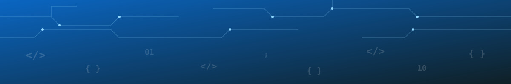

  

<h1 align="center">Krishna Saha</h1>

  

  
  
  

  
  

 

## About Me

Aspiring Software Engineer focused on building scalable, full-stack web applications.

- 🔭 **Frontend:** crafting intuitive interfaces with HTML, CSS, JavaScript, and React
- ⚙️ **Backend:** server-side architecture, REST APIs, and database design
- 🏆 **Competitive Programming:** 2-Star rated on CodeChef
- 🌱 Currently deepening my knowledge of scalable backend systems
- 💬 Always open to collaborate on open-source or talk through new tech ideas

 

## Tech Stack

<table align="center">
<tr>
<td valign="top" align="center" width="33%">

**Frontend**
  

</td>
<td valign="top" align="center" width="33%">

**Backend**
  

</td>
<td valign="top" align="center" width="33%">

**Tools**
  

</td>
</tr>
</table>

 

## GitHub Activity

  

<table align="center">
<tr>
<td valign="top" width="50%">

</td>
<td valign="top" width="50%">

</td>
</tr>
</table>

  

  

 

